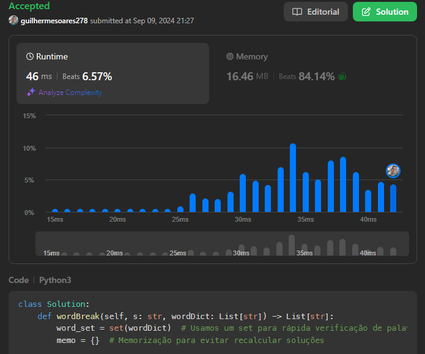

# 140 - Word break II

Given a string s and a dictionary of strings wordDict, add spaces in s to construct a sentence where each word is a valid dictionary word. Return all such possible sentences in any order.

Note that the same word in the dictionary may be reused multiple times in the segmentation.
 
Example 1:

Input: s = "catsanddog", wordDict = ["cat","cats","and","sand","dog"]
Output: ["cats and dog","cat sand dog"]

Link para o enunciado completo:

https://leetcode.com/problems/word-break-ii/description/?envType=problem-list-v2&envId=dynamic-programming

Submissões:

